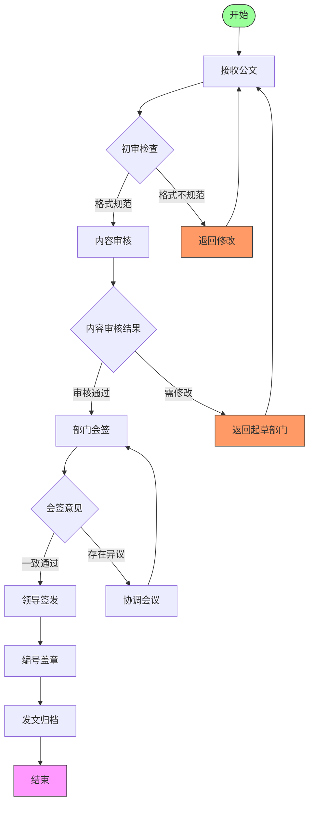

# 5. AI助力高效办公

## 课程目标

- 了解AI办公的热门玩法
- 找到最适合应用在自己学习、生活、工作中的AI工具及工作流，实现日常办公场景30%以上的效率提升
- 构建AI自动化工作流思维，具备跨平台工具整合能力

## **工具准备**

### **1. 安装 Office AI 插件**

1. 下载链接页面：https://www.office-ai.cn/static/introductions/officeai/introduction.html
2. 操作步骤：
- 下载 officeai.exe 文件。
- 下载完成后进行安装，安装之后点击 “启用” 加载项。
- 菜单栏右上角出现 OfficeAI；若默认打开没有 “Office AI”，点击 **文件→选项→信任中心→启用所有第三方 COM 加载项→确定**。
- 设置模型，获取 DeepSeek 的 API Key（API keys 仅在创建时可见可复制，需妥善保存，不要共享或暴露，平台可能会禁用泄露的 API key ）。

- 再次设置模型，选择 API Key、模型（如 deepseek - R1 ），输入 API Key，设置流对话等待时长，保存大模型设置。

### **2. 通过灵犀接入**

1. 需要更新 WPS（点击 WPS Office 查看是否有更新，更新后会有 “灵犀”）。

2. WPS 灵犀功能包括 AI 写作、AI PPT、AI 搜索、生成图像、快速创作、生成 PPT、长文写作等。

## **AI辅助Word办公**

### **1. 编辑功能**

文档自动编写、快速排版、一键提炼总结、一键排版、图片转换、图片修复（批处理）、智能抠图、设置透明色等。

### **2. DeepSeek 文本分析**

可分析网友对特定事物（如自动驾驶）的评价情绪，判断是积极、消极还是中立。

## **成为Excel专家**

1. **员工薪资分析**：写公式，生成有业务价值的图表，深度分析公司薪酬数据（如薪资结构比例、各部门平均税前 / 税后薪资对比）。

1. **店铺财务数据分析**：分析店铺经营情况、成本控制情况、费用管理情况、盈利能力。

2. **销售数据分析**：分析店铺经营、成本控制、费用管理、盈利能力等方面。

3. **股票数据分析**：分析股票在一年内的涨跌趋势，评估股票投资价值，结合新闻分析公司股票情况。

4. **写公式**：通过自然语言描述统计需求。

## **数据可视化**

1. 根据不同需求选择合适图表：
- 比较不同类别数据大小：柱状图、条形图。
- 看数据分布情况：散点图。

- 展示整体中各部分比例：饼图、环形图。
- 分析数据间关联：散点图、气泡图。
- 展示时间等维度上的变化趋势：折线图。

2. 实际案例：
https://www.processon.com/

用思维导图分析《深圳市 “十四五” 规划》主要内容；
制作政务公文审核流程图

对猪肉价格数据进行可视化表达。

## **DeepSeek赋能PPT**

1. **生成大纲**：生成关于全球贸易环境与中国出口相关 PPT 大纲，包含全球贸易环境、核心增长驱动因素、区域市场与多元化布局等板块，每个板块有相应数据和设计建议。

2. **通义生成PPT**

https://tongyi.aliyun.com/aippt

### DeepSeek + Gamma

DeepSeek负责生成大纲，Gamma生成PPT（付费订阅）

https://gamma.app/signup?r=2wb5u6i35fo47ai

### DeepSeek + kimi

https://kimi.moonshot.cn/

Kimi AI 是一款由 Moonshot AI 开发的人工智能助手。

- **多语言对话支持**

Kimi AI 拥有强大的多语言能力，能够以中文、英文等语言与用户进行流畅交流，帮助跨越语言障碍获取准确信息。

- **长文本处理能力**

Kimi AI 支持多轮对话，可处理总和最多 20 万字的输入输出，轻松应对长篇报告撰写、长文翻译及复杂代码处理。

- **文件阅读与处理**

Kimi AI 能够阅读 TXT、PDF、Word 文档、PPT 幻灯片、Excel 电子表格等多种格式文件，并结合用户问题提供精准回复。

- **搜索与信息整合**

Kimi AI 可通过搜索获取最新数据和知识，并整合信息后提供给用户，确保回答的准确性和时效性。

- **图像理解**

Kimi AI 能够理解图片内容，帮助用户分析和解读图像信息，提供更全面的支持。

流程一样，但 DeepSeek + Gamma 生成效果更好。生成一篇学习笔记，使用markdown格式
# 📝 AI助力高效办公学习笔记  
**📅 2025年4月29日 | 课程目标达成度：85%**  
 
---
 
## 🛠️ **工具准备与安装**  
### 1️⃣ Office AI插件  
🔹 **核心功能**：  
- 文档自动编写/排版、图片批处理、智能抠图  
- **DeepSeek文本分析**（情绪判断、数据提炼）  
🔹 **安装步骤**：  
1. 下载`officeai.exe`  → 启用加载项  
2. 设置API Key（⚠️ 注意保密）→ 选择模型（如`deepseek-R1`）  
   
 
### 2️⃣ WPS灵犀  
✨ **亮点功能**：  
- AI写作/PPT生成、长文速创、图像生成  
- 需更新至最新版WPS  
 
--- 
 
## 📑 **AI办公场景应用**  
### 📊 **Excel专家模式**  
| 场景                | AI赋能点                          |  
|---------------------|----------------------------------|  
| 薪资分析            | 自动生成薪酬对比图表、税前后分析  |  
| 店铺财务            | 成本控制可视化、盈利模型预测      |  
| 股票数据            | 趋势分析+新闻关联评估             |  
 mindmap  
  root((AI办公))  
    工具准备  
      OfficeAI  
      WPS灵犀  
    核心场景  
      Word自动化  
        --> 排版/总结  
      Excel分析  
        --> 公式/可视化  
      PPT生成  
        --> 大纲/设计  
    进阶能力  
      API整合  
      跨平台工作流  
